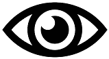

# easylens

This tool can improve accessibility for the visually impaired in a website.

Insert these snippets:

```
<script src="easylens.js"></script>
 . . .
<a href="javascript:easyLensButton.toggleLens();"></a>
```

Please remember to put the `easylens.js` and `eye.png` in the directory.

Image credits: https://pixabay.com/users/mohamed_hassan-5229782/
